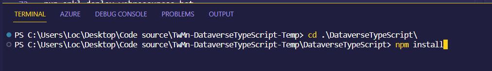
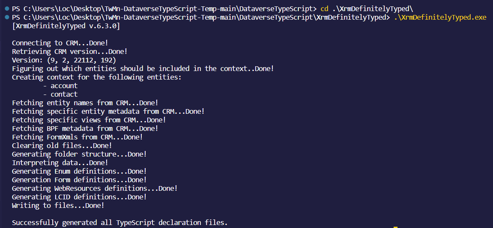
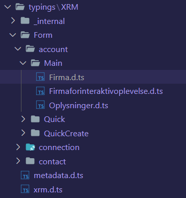
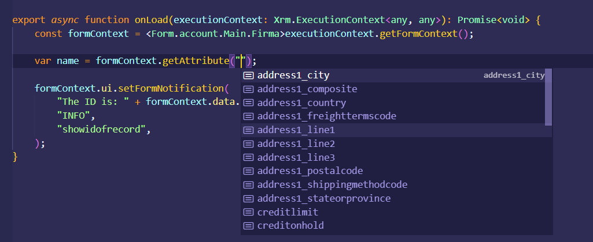

# TwMn-DataverseTypeScript-Temp

This project is a template to get started with developing Dataverse Webresources using TypeScript instead of Vanilla JavaScript. How to setup the project so that it is connected to your Dataverse environment will be described step by step below, enjoy! 🤗

## Why TypeScript? 🤯

- TypeScript supports JS libraries & API Documentation
- It is a superset of JavaScript
- It is optionally typed scripting language
- TypeScript Code can be converted into plain JavaScript Code
- Better code structuring and object-oriented programming techniques
- Allows better development time tool support
- It can extend the language beyond the standard decorators, async/await

Read more about TypeScript vs. JavaScript [here](https://www.guru99.com/typescript-vs-javascript.html)

## Prerequisites 💤

- Basic JavaScript experiences
- TypeScript/JavaScript IDE (Recommending [Visual Studio Code](https://code.visualstudio.com/))
- NodeJS installed. You can download it [here](https://nodejs.org/en/)
- An App Registration in Azure Active Directory for Service Principal based authentication to the Dataverse environment. [How to create an App Registration?](https://nanddeepnachanblogs.com/posts/2022-06-15-azure-devops-pipeline-power-platform-1/)

## Folder structure

The project contains differents folders and dependency files. I will not explain all of them. The important folders are "ts" and "webresources". The "ts" folder include all our stuff around TypeScript. The "webresources" folder contains the actual webresource that get deployed to Dataverse.
In the end we are still deploying JavaScript files to Dataverse. So when we are developing webresources using TypeScript we still need to convert it to JavaScript.

```
Root
├── ts
│   ├── src
│   │   ├── code
│   │   │   ├── forms
│   │   │   │   ├── *.ts
│   │   │   ├── ribbon
│   │   │   │   ├── *.ts
├── webresources
│   ├── js
│   │   ├── *.js
```

# Setup step-by-step

### 1. clone or download the template project

### 2. Open the cloned/downloaded folder in your IDE ([Visual Studio Code](https://code.visualstudio.com/))

### 3. Install depedencies, node_modules.

Use a terminal and navigate to "DataverseTypeScript" folder and execute the following commando:

```
npm-install
```

I'm using the terminal within [Visual Studio Code](https://code.visualstudio.com/)



You'll then notice a new folder called "node_modules" added to your project. This folder contains all the dependency libraries needed for this project.

### 4. Config XrmDefinitelyTyped

XrmDefinitelyTyped is a tool to generate TypeScript declaration files based on your Dataverse solution. This right here is the bomb 💣! With these TypeScript declaration files and the right IDE ([Visual Studio Code](https://code.visualstudio.com/)) you'll get Intelligent code completion for the elements within the Dataverse forms. This make development much easier.

Go to "XrmDefinitelyTyped" folder and open "XrmDefinitelyTyped.exe.config". You'll see following xml content:

```xml
<?xml version="1.0" encoding="utf-8"?>
<configuration>
  <appSettings>
    <add key="url" value="https://<environmentName>.crm4.dynamics.com/XRMServices/2011/Organization.svc" />
    <add key="out" value="../ts/src/code/typings/XRM" />
    <add key="entities" value="account, contact" />
    <add key="mfaAppId" value="<App ID>" />
    <add key="mfaClientSecret" value="<Client Secret>" />
    <add key="method" value="ClientSecret" />
  </appSettings>
</configuration>
```

- Add your environmentName
- Add your App ID and Client Secret from the App Registration in Azure Active Directory

The example above only tells the tool to generate declaration files for account and contact tables. You can extend this string with more tables using the logical name and seperate them with comma, example "account, contact, opportunity, lead".

### 5. Execute XrmDefinitelyTyped.exe

Run "XrmDefinitelyTyped.exe" program to generate the TypeScript declaration files. You can find the program in the "XrmDefinitelyTyped" folder. This program will authenticate to your Dataverse environment based on the config file as mentioned above.



If the run was successfully you'll then notice a new folder called "typings" under ts-->src-->code. This folder contains all the TypeScrips declaration files for account and contact tables in this case.



### 6. Lets write a TypeScript function

This project comes with a TypeScript file called "demoForm.ts", lets use that one to write our first TypeScript function. You can always add more .ts files. You can find the file under ts-->src-->code-->forms.

Override whatever content in the file with the following code:

```TypeScript
export async function onLoad(executionContext: Xrm.ExecutionContext<any, any>): Promise<void> {
    const formContext = <Form.account.Main.Firma>executionContext.getFormContext();

    var name = formContext.getAttribute("name");

    formContext.ui.setFormNotification(
        "The ID is: " + formContext.data.entity.getId() + " and the Name is: " + name.getValue(),
        "INFO",
        "showidofrecord",
    );
}
```

The TypeScript function "onLoad" will display a notification on account form.

If you are familiar with JavaScript development against Dataverse forms you'll notice that the naming convention of the methods are the same. "getFormContext", "getAttribute", "setFormNotification" and so on.

So why all this struggle when it look and behave like JavaScript? If you take a look at the declaring of "const formContext" we are now telling this formContext that it is of the type of the main form called Firma from account table.

```TypeScript
const formContext = <Form.account.Main.Firma>executionContext.getFormContext();
```

Now when we are using the formContext constant to get attribute within the Firma form we will get Intelligent code completion and see which attribute the form contains.



These declarations were the ones we generated with XrmDefinitelyTyped tool. Now you don't need to remember the logical name of the fields. Whenever a form gets updated you need to run this tools so that the TypeScript declaration files are ajour with your Dataverse forms.

### 7. Convert TypeScript to JavaScript

By the end of the day your webbrowser still only understands JavaScript 😱.
So we need to convert the TypeScript file to JavaScript which we will use to deploy to Dataverse as a Webresource.

Firstly we need to tell TypeScript build mechanism how it should build our JavaScript files based on our TypeScript files.
To do so we need to config webpack.common.js.

```js
const path = require("path");
const { CleanWebpackPlugin } = require("clean-webpack-plugin");
module.exports = {
  devtool: "source-map",
  entry: {
    demoForm: "./ts/src/code/forms/demoForm.ts",
  },
  output: {
    filename: "<prefix>.[name].js",
    sourceMapFilename: "maps/[name].js.map",
    path: path.resolve(__dirname, "./Webresources/js"),
    library: ["<prefix>", "[name]"],
    libraryTarget: "var",
  },
  module: {
    rules: [
      {
        test: /\.(ts|tsx)$/,
        use: "ts-loader",
        exclude: /node_modules/,
      },
    ],
  },
  plugins: [new CleanWebpackPlugin()],
  resolve: {
    extensions: [".ts", ".js"],
  },
};
```

Under "entry" level you can declare which TypeScript files you want to convert to JavaScript. In our case we only have the "demoForm.ts".

Under "output" level we can configure how the output files should be created. For the JavaScript filename it will be a prefix (use the same as in your Power App solution), the name of the TypeScript file (demoForm) and .js. The library define the name of the functions within the JavaScript files. Prefix (again use the same as in your Power App solution), the name of the TypeScript file (demoForm) and the name of the function. In our case for demoForm it will be "[prefix].demoForm.onLoad". This is the full name of the function when you register it on a Dataverse form.

Time to build!

Use a terminal and navigate to "DataverseTypeScript" folder and execute the following commando:

```
npm run build
```

You will then see the JavaScript file for "demoForm.ts" under webresources-->js.

# Deploy JavaScript as Webresource

spkl.json config

run spkl deploy-webresources.bat

Show the webresource

Add the webresource to the form

Test in form
